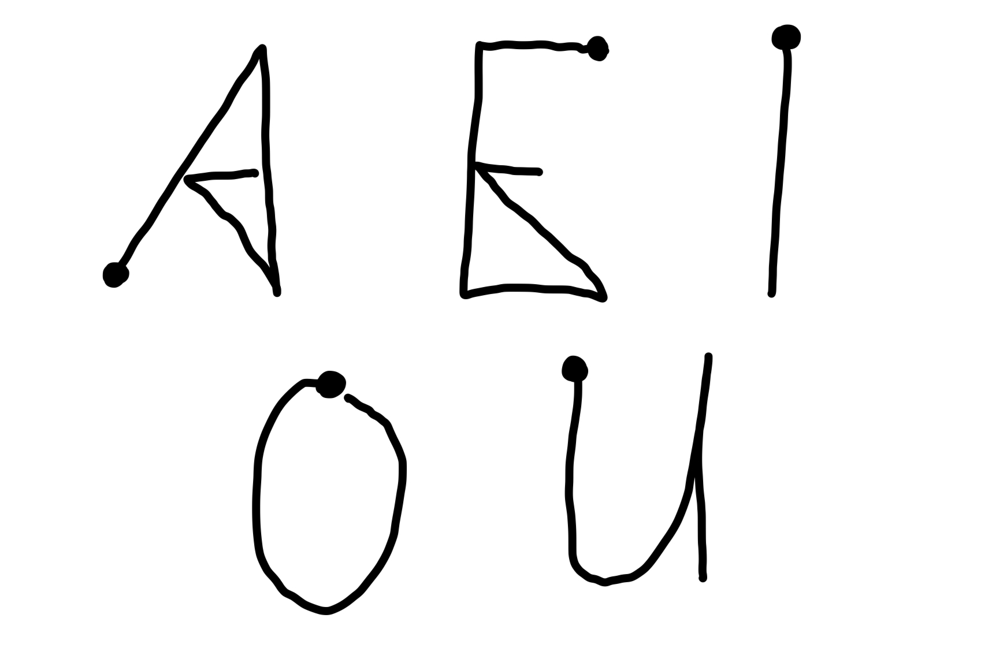

# Task 1

## Erster Ansatz:

Hierfür wurde eine XML Datei pro Name aus dem Datensatz ausgewählt und für das "training" verwendet.

Mein Recognizer hat 4792 der 5280 vorgelabelten Gesten erkannt. Damit hat er für diesen Datensatz eine Accurary von über 90%.

## Zweiter Ansatz:

Hierfür wurden quasi alle Daten als Trainingsdaten verwendet. Es wurde pro Name ein neues Unistroke Objekt erstellt, das die durchschnittlichen Punkte enthält. Dies ist möglich, da die Daten vorab ja schon in die richtige Form gebracht wurden. Das "Training" dauert hier allerdings länger.

Mein Recognizer hat 5030 der 5280 vorgelabelten Gesten erkannt. Damit hat er für diesen Datensatz (ist aber auch der Trainingsdatensatz...) eine Accurary von über 95%.

## Input:

Beim Ausführen des Zeichnens wird auch gleich gespeichert (für Task 2). Hierfür kann das entsprechende Label übergeben werden, z.B. `python gesture-input.py left_curly_brace`

# Task 2

Ich habe das Notebook aus der Vorlesung (lstm_demo.ipynb) verwendet und modifiziert. Um die Parameter zu reduzieren, habe ich jeweils die Neuronen um die Hälfte reduziert. 
Die Auswertung befindet sich in unistroke-gestures.ipynb.

# Task 3

Idee:
Anwendung, um Buchstaben schreiben zu lernen bzw. Handschrifterkennung. Ich habe dies nur für Vokale in Großbuchstaben implementiert. Links wird jeweils der Buchstabe angezeigt, der auf die Tafel geschrieben werden soll.

Auch hierfür wurde wieder das Notebook lstm_demo.ipynb verwendet. Die veränderten Stellen sind entsprechend markiert. Für das Zeichnen wurde wieder pyglet verwendet.